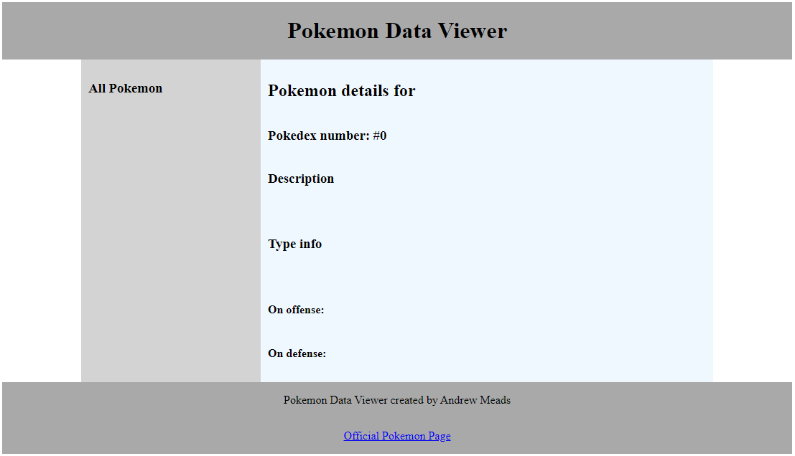
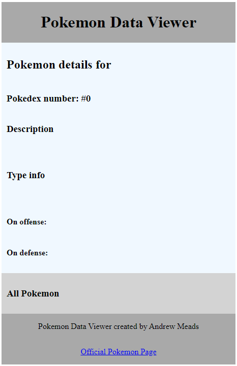

# Web Assignment Pokemon Page

## Project overview
- Four main steps in the assignment
- 70 marks total
    - 10 marks for a basic HTML template
    - 25 marks for populating the page with data from `trex-sandwich` using AJAX `fetch()` requests
    - 10 marks for beautifying your webpage
    - 15 marks for adding a "favourites" feature (*research question!*)
    - 5 marks for flexibility & robustness
    - 5 marks for code quality

### Introduction
In this assignment you will create the client-side code for a page that will display data about Pokemon. The page will use AJAX so that it can dynamically load new data into an already loaded page.

The assignment involves the use of JavaScript to modify the contents of a webpage, and `fetch()` to load data from an external API hosted on our `trex-sandwich.com` server. As preparation material, the code from the module focused on AJAX is particularly relevant and you should be familiar with the concepts in Modules One thru Six.

You should write all of your code using the technologies taught in the lectures/labs in this course as evidence that you can apply the concetps taught up to this point in the course. You should not use any other larger external libraries, frameworks or pre-written CSS, JS or HTML. It is ok to reuse a few lines of code from other sources as long as you cite it in your comments and have a good justification for using it. Some sections of the assignment give you quite a lot of freedom to research your own design and implementation; it is very important that these steps are your own unique work and that you work on them independently to other students. If you have any doubts about how you are approaching certain tasks or which technologies you are using please contact the teaching team to check that it's OK.

### Project structure
In the project directory, you have been provided with a blank HTML template `index.html` along with an associated JavaScript (`script.js`) and CSS file (`style.css`). You may edit all three of these files in any way you like when completing this assignment. You may *not* add any new files, nor modify any other files.

### General description
You will create a single page that will allow a user to view data about all Pokemon and Pokemon types. As the user selects options on the page, the data will be loaded dynamically from our server (`trex-sandwich.com`) with fetch requests, and displayed in the page through client-side JavaScript code.

The page will be responsive and change from a maximum of three columns wide for wide screens to a single column layout for smaller screens. The page will be structured with multiple divs that are positioned using CSS grid.

## Your Tasks
Follow the steps in this section in order to complete the assignment. Each task has an associated number of marks.

### Step 1: Creating the Responsive HTML Template (10 marks):
To begin, create an overall responsive page layout using HTML and CSS. The page will be made up of five separate sections/divs. These will be:

- The header; with the main `h1` heading `Pokemon Data Viewer`
- The main content with a `h2`heading `Pokemon Details For:`
- A sidebar on the left of the main content with a `h3` heading `All Pokemon:`
- A sidebar on the right of the main content with a `h3` heading `Pokemon Type Data For:`
- A footer that notes who the author of the page is (you) and a link to the official Pokemon page (`https://www.pokemon.com/`)

You should think carefully about how you structure your code and how you use ids for your divs as you will need to be dynamically modifying the code with client-side JavaScript in later steps.

These sections/divs should be structured with the use of a CSS grid and the sections should be laid out like this: 

You do not need to use the same colour scheme as this screen-shot and you will be creating your own unique design in `Step 3`. There are no exact sizes you need to use for padding and margin etc but you need to make sure that the page displays all content appropriately on standard screen sizes. You should keep resizing and testing your page as you develop it to check that it is compatible with text content and images that will be loaded later.

You should also make your grid responsive so that on smaller screens it is re-arranged to look like this:

You should test your page and decide carefully at what screen width the 3 column grid layout should change to the single column layout; there is no exact screen size it should but you may need to adjust this to suit the content that is loaded in later steps.

When you have finished Step 1, your page should look similar to the screenshots above but may use different colours.

### Step 2: JavaScript code (25 marks total - see breakdown below):
In this step, you'll populate your application with data loaded from `trex-sandwich.com`, and add interactivity such that information about different Pokemon can be viewed by clicking their names in a list.

The provided API is documented in [API-Documentation.md](./API-Documentation.md), available in this repository. Please read through thoroughly, and experiment with the different endpoints by trying them within your browser.

**IMPORTANT:** For this step, you are only given screenshots, general requirements and hints. You will need to think very carefully about how you break the task down into steps and apply the knowledge from the relevant lectures and labs.

The end result should look something like [this screenshot](./spec/Step2Complete.jpeg) in the spec folder when full-size, and [like this](./spec/Step2CompleteMobile.jpeg) on narrow screens.

All of the data should be requested from the server with fetch requests to the endpoints provided, and should be and dynamically added to your HTML page with JavaScript.

How you structure your client-side code is up to you but it is STRONGLY suggested that you aim to break the task down into small functions and steps that you can develop, test and debug. You may modify your CSS and HTML from the earlier steps to add the elements and classes necessary to effectively display the content that is received from the server.

Here are the functional requirements for how your client-side code should render the data received from the AJAX fetch requests and allow the user to interact with it: 

- Every time the page is refreshed, the lefthand sidebar should display a list of all known Pokemon species (see *API Endpoint #1*) **[5 marks]**.

- The main panel should display the image and details of a selected Pokemon as seen in [this screenshot](./spec/Step2Complete.jpeg).

    - When the page is first loaded or refreshed, a random Pokemon should be loaded as the selected Pokemon (see *API Endpoint #3*) **[5 marks]**.

    - Whenever the user clicks on a Pokemon's name in the sidebar, its detailed information should be loaded (see *API Endpoint #2*) **[3 marks]**.

- Also on the main panel, below the Pokemon info loaded from API endpoints #2 / #3, we should display *type* data for the currently selected Pokemon.

    - If the user selects a new Pokemon from the list, the type data displayed should change to match the newly selected Pokemon **[3 marks]**.

    - There are two sections to the type data. The first is the "offense" section (see "On offense" in [this screenshot](./spec/Step2Complete.jpeg)). This section should display one table for each of the currently selected Pokemon's types (the screenshot shows two tables here, because Charizard has two types - Fire and Flying). The data to display can be obtained from *API Endpoint #4* (`offenseDamageMultipliers`) **[4 marks]**.

    - The second type data section is the "defense" section. This section should display one table, showing the defense profile of the currently selected Pokemon (see *API Endpoint #5*) **[3 marks]**.

    - Rather than display multiplier values directly, text should be displayed instead, as follows **[2 marks]**:
        - **Multiplier `0`:** "No damage"
        - **Multiplier `0.25`:** "Quarter damage"
        - **Multiplier `0.5`:** "Half damage"
        - **Multiplier `1`:** "Normal damage"
        - **Multiplier `2`:** "Double damage"
        - **Multiplier `4`:** "Quadruple damage"

**Hints:**
- Before adding new type data tables to your page, it might pay to delete any which are already there. You can easily clear an element's children using the following code: `elem.innerHTML = "";`.

- Consider how you can reuse code you write. The code for displaying offensive and defensive type info is nearly identical. If you find yourself copy / pasting your own code, consider how you might refactor it into a shared function instead.

### Step 3: Unique CSS and Design (10 marks): 
For this step you should research a carefully chosen design that does not look like the screenshots provided to you. The main constraint is that the content still displays on the page appropriately for both wide and narrow screens.

**Requirements:**
- Your design must make use of coloured backgrounds for the main divs and cannot be primarily white backgrounds.

- You must chose a customised colour palette that does not use default web colours or the colours in the screenshots provided; there are plenty of colour palettes provided online.

- You must use a non-standard font or combination of fonts. Make sure that the font suits the general theme of your design.

- You can use extra images and background images if you want, but only if they enhance your chosen design and display appropriately on different screen-sizes.

- Even though minimalist designs can be effective, for this step you must choose a more interesting & complex design that has a clear colour palette and uses extra CSS properties that are beyond just the essentials.
    
    - Examples of extra CSS properties would be rounded corners, transitions, animations, filters, carefully styled borders.

- Research a more complex design style carefully and try to replicate it in your site; do not copy large amounts of irrelevant CSS from other places though, you should not be adding CSS that is not directly selecting elements in your page.

 ### Step 4: Research Feature - Favourites with Client-Side Storage (15 marks):
 **IMPORTANT:** This feature is potentially difficult and requires you to research technologies that you have not yet been taught in the course. Only the very general requirements of this are given to you. You have a lot of freedom as to how you implement this feature but it is important that you research and plan carefully before starting the code.

 #### Task outline:
 For this research feature, you must create the ability for a user to add a Pokemon to a list of favourites. That will displayed in the page within a new "favourites" section of the page. When a user has selected an item as a favourite, the images of their favourite Pokemon should appear in the new section of the page.

 The user should be able to select a Pokemon as a favourite through some sort of link or button that you add to the main view.
 
  **IMPORTANT NOTE ON RESEARCH COMPONENT:** The list of favourite Pokemon must somehow be stored with a client-side browser technology so that if the user closes their browser and reopens the same page in the same web browser, the favourites are still saved from the last time the page was open. There are several technologies with which you could do this; **client-side** `cookies`, `local storage` or `session storage` should all be options that would work. You should research one of these and implement it.

 The favourites section should be a separate section of the page that is integrated into your responsive CSS grid so that the whole page still displays on narrow and wide screens. You can chose where in the page the favourites are displayed, but make sure that the ways they are displayed fits well with your unique design that you chose in `Step 3`.

 The content in the new section must display in a way that is functional and looks good no matter how many favourites are selected. It must function for 0, 1 or all of the Pokemon being selected. Think carefully about how you could use modern CSS features like flexbox to accompolish this.

 You should consider the usability of this feature and try to make it as intuitive as possible. It is suggested that users be able to `un-favourite` a Pokemon and remove it from their favourites list in case they accidentally click it or grow to dislike a Pokemon overtime.

## Flexibility & Robustness (5 marks):

### Robustness:
Your page should display appropriately regardless of what combination of links/buttons the user clicks and what size their screen is. You should make sure that the page never crashes. You should also make sure that your JavaScript code is written in a way that the page will not crash completely if any one individual fetch request fails.

Most importantly, make sure that the code you submit is as functional as possible. **IF** there are sections you have not completed that cause bugs, you should organise the code so that these sections are commented out or not called so the page can still be tested for marking. The marker will potentially look at commented out code to give partial marks for partially complete features but they should NOT need to fix bugs just to see what has been completed on earlier features.

### Flexibility:
The code should be able to easily allow future changes to functionality and the underlying data. If you use lots of smaller functions with well chosen parameters this should help code cope with changes to the underlying data or new features. You should use this opportunity to read a bit more about the general concept of flexibility in programming/computer science as it is a fundamental principle that is relevant for all programming contexts. At a bare minimum, your code must be able to cope with new Pokemon and Type data being added to `trex-sandwich`, or existing data being changed. You should not have any hardcoded references to specific Pokemon or types.

## Code Quality (5 marks):
You should aim for good code quality in all of your code you write.

This should include:
- Using well chosen variable and function names that would make it easy for another person to understand the intent of all variables and functions.

- Use functions effectively, it is good coding practice to use lots of shorter functions/methods and avoiding repetition or nesting many control structures together (e.g. many loops inside loops or lots of if statements inside other if statements); use parameters and return values from functions where appropriate.

- All code should be indented in a way that makes levels of nesting obvious to anyone viewing or editing the code.

- You should aim to use `white space` and blank lines as appropriate to add space around operators and functions.

- You should follow clear conventions & consistent for things like variables, functions, ids etc.

- Your CSS should use selectors efficiently so as to avoid repetition of properties that are common across multiple types of elements; consider things like using CSS variables so that you only set things like colours and margin sizes in one place rather than repeating values many times that may later need to be changed in multiple places.

- You should use good coding practice like using constants where appriate and scoping variables according to good practice; only make non-function scoped variables if there is a good reason to.
